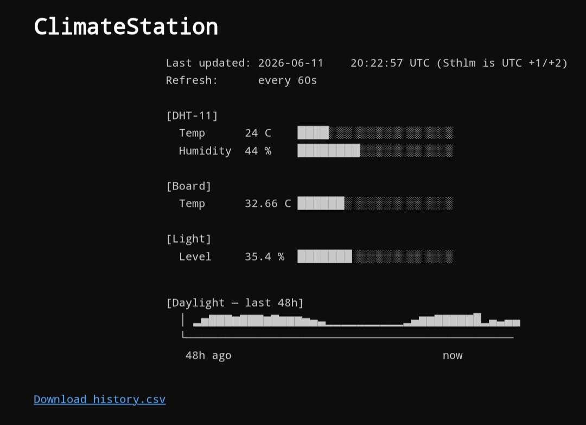
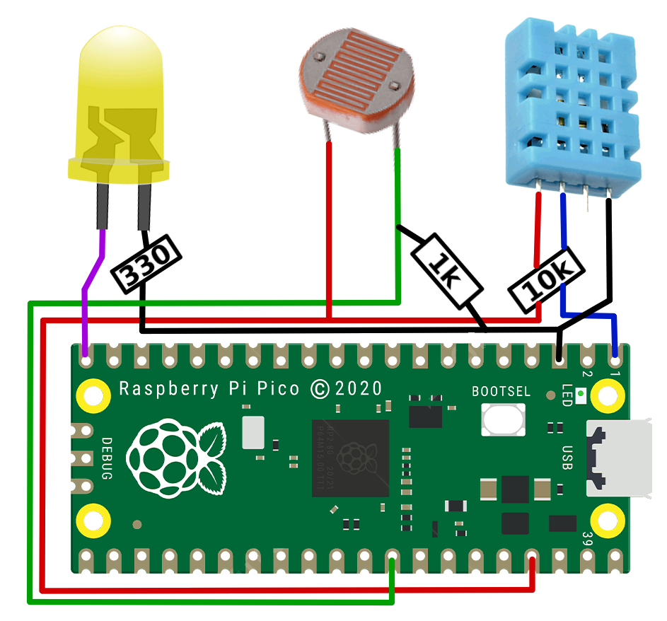

# ClimateStation v2

A lightweight IoT climate monitor running on a Raspberry Pi Pico W. Reads temperature, humidity, and light level, then serves a terminal-aesthetic dashboard on the local network. No cloud dependency.

Soldered onto matrix board and housed in a custom 3D-printed case — designed to sit cleanly on a desk or shelf as a permanent fixture.

Successor to [ClimateStation](https://github.com/ExtraSlowCode/ClimateStation/tree/main) — reworked for local hosting, removed DataCake dependency.

---




---

## Hardware

| Component                | Purpose                     |
|--------------------------|-----------------------------|
| Raspberry Pi Pico W      | Microcontroller             |
| DHT-11                   | Temperature + humidity      |
| Photo resistor (CdS 5mm) | Light level                 |
| On-board sensor (ADC4)   | Secondary temperature       |
| Green LED                | Activity indicator          |
| Matrix board             | Permanent soldered assembly |

## Build

The circuit is soldered directly onto matrix board rather than using a breadboard, keeping the assembly compact and reliable. A custom case designed in TinkerCAD houses everything and is printed in standard PLA on an Ender 3.

Print settings:

- Filament: 1.75mm PLA
- Default supports
- Standard quality settings

The case design is included in `/case` as a `.stl` file.




## Features

- Local HTTP dashboard — no internet required beyond NTP sync for sensor function
- Terminal aesthetic: monospace, dark, ASCII bar charts
- Rolling CSV history with tiered retention:
  - Full resolution (10 min) for the last 7 days
  - Compressed (1 reading/hour) beyond that, ~5 months total
- `/history.csv` download endpoint
- Threaded: sensor loop and web server run independently

## Setup

1. Flash `micropython.uf2` onto the Pico W [micropython.org](https://micropython.org/download/RPI_PICO_W/)
2. Copy all files from `/src` to the Pico
3. Create `keys.py` with your WiFi credentials:

    ```python
    SSID = "your_network"
    PSWD = "your_password"
    ```

4. Power on — the Pico will blink the activity LED on startup, then connect
5. Find the assigned IP in the serial console and open it in a browser

## File Structure

```bash
src/
  main.py       # Startup, threading, sensor loop
  sensors.py    # DHT-11, board temp, light level reads
  server.py     # HTTP server, page rendering
  state.py      # Shared state with thread lock
  storage.py    # CSV read/write, tiered compression
  keys.py       # WiFi credentials (not committed)
case/
  climatestation.stl
```

## On AI Assistance

The software refactoring; restructuring the original monolithic script into a modular, threaded codebase, was done with Claude as a development aid. The sensor hardware, physical build, wiring, case design, and original project are entirely my own work. I've kept the AI use here because the task was largely mechanical restructuring rather than problem solving, and the result was reviewed and understood before being deployed. It's disclosed here in the interest of transparency.

## Notes

- Timestamps are UTC — Stockholm is UTC+1 (CET) or UTC+2 (CEST)
- The board LED stays on as a WiFi connection indicator
- `keys.py` is excluded from version control — keep it out of commits
